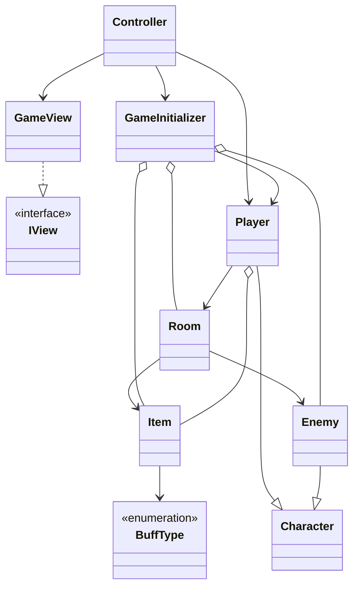

# Yet Another Dungeon Crawler

## Autoria

A work by:

- Afonso Cunha - a22302960
    - Responsible for:

- Júlia Costa - a22304403
    - Responsible for:
  
  
- Mariana Martins - a22302203
    - Responsible for:

[Git repository URL](https://github.com/Juhhxx/YetAnotherDungeonCrawler_LP1)

## Solution architecture

According to the briefing on this project, the architecture of this same work follows the principles behind the **MVC** software design pattern. As such, it is divided, conceptually and logically in 3 elements: **"Model"**, **"View"** and **"Controller"**. Adding to this, for the fixed map, Enemy and Item stats' "database" we opted for 3 .txt files that store everything needed to initialize each of these.

Regarding this software design pattern, each of these 3 elements is responsible for a type of specific function, "spitting out" the result of their very limited actions and never taking up on something that isn't of its responsibility. The functional limits of each element in this model are very strict.

Everything included in the "Model" element is exclusively related to the fundamental logic behind the gameplay, actions and execution.
Everything under the "View" element is responsible for UI, printing information to the player and input requests.
Finally, the "Controller" element is responsible for making the connection between the two previously explained elements. It controls the game itself by calling what is needing and "communicating" between the logic and UI elements.

### Text Files - Description

1. **Enemies.txt**
    - File containing each type of enemy and its individual **description**, **HP**, **attack power** and **defense**.
  
2. **Items.txt**
    - File containing each type of item and its **name**, **type** and **buff value**.

3. **Rooms.txt**
    - File that  is, in all practical regards, the map. Every single room is numbered and contains:
        - **Description**
        - **Information on if there is or not a room in the each of the 4 cardinal direction (North, West, South and East), specifying said rooms' names in the such rooms do exist in those directions**
        - **Information on if there is an enemy present in the room, specifying its name in such occasion**
        - **Information on if there is an item present in the room, specifying its name in such occasion**
  
### "Model" Element - Description

1. **Enum BuffTypes**
    - Enum containing the 3 different types of stat buffs that can exist: HP, Attack and Defense buffs.

2. **Class Character**
    - This is an abstract class that serves as the base for any character in the game, with the purpose of being extended in order to create more role-specific character like a player or enemy. As such

        - **public int Attack(Character target)** - Method for combat between characters. It calculates the hit power of an attack by by first removing the targets defense out of the value and clamping it to 0,  and then applying the remaining value to the target's HP and clamping it to 0, returning the hit power of the attack.
        - **public bool IsDead()** - Method that sees if the character is dead by checking if **HP <= 0**, returning the boolean resulting from it.

3. **Class Enemy : Character**
    - This class has only the constructor for a specific enemy, inheriting the **Attack()** and **IsDead()** methods from its parent class - **Character**, but has no enemy specific methods.
4. **Class Player : Character**
    - Like the Enemy class, this one has a specific constructor for the player character, inheriting as well the **Attack()** and **IsDead()** methods, while having some more player-specific ones:

        - **public void SetInitialRoom(Room initialRoom)** - Method to set the room that the player is initially in;
        - **public bool Move(string direction)** - Method that moves the player between rooms, by checking if the given direction, in the current room's accessible rooms library, is not blocked off. Moves the player and returns true if the player can walk in that direction, otherwise returns false and the player doesn't move;
        - **public bool PickUpItem(Item newItem)** - Receives an Item and Adds it to the Inventory if it is not full. Returns true if the inventory is not full, returns false if it is full;
        - **public void Heal(Item potion)** - Adds the buff a potion gives to the health of the Player, and then removes the potion from the Player's Inventory;
        - **public bool Equip(Item newItem)** - Adds the buff from a weapon or shield adding it to the attack power or defense stat of the Player, then setting it to weapon or shield property, and then removes the item from the Player's current room;
        - **public Item ConfirmItem(bool isPotion)** - Method to confirm if the item in the Player's current room is or not a potion. If the method confirms the item is a potion, it returns the item, else it returns null;
        - **public Enemy ConfirmEnemy()** - Method that returns the Player's current room's enemy. It will return null if there is no enemy, and return the enemy if it is not null;
        - **public bool CheckForItem()** - Method that returns if the Player's current room has an item. It will return false if there are no items, and return true if there is an item;
        - **public bool CheckForEnemy()** - Method that returns if the Player's current room has an enemy. It will return false if there is no enemy, and return true if there are enemies in that room;
        - **public Item SearchInInventory(string name)** - Method that looks through the Inventory for the first item with a given name. Returns the item if it is not null (if it is in the inventory), and return null if there is no item;
        - **public bool FoundFinalRoom()** - Method that checks if the Player has found a final room, returning **IsFinal()** using the current room as its parameter;
5. **Class GameInitializer**
    - This class is responsible for initializing the objects necessary to the game, as well as having some methods to verify some values related and necessary to such initializations.

        - **public void InitializeGame()** - Call all of the initializer methods to start the game;
        - **private void InitializeEnemies()** - Initialize all Enemy instances given in the Enemies.txt file;
        - **private void InitializeItems()** - Initialize all Item instances given in the Items.txt file;
        - **private void InitializeRooms()** - Initialize all the Room instances give in the Rooms.txt file;
        - **private string NullOrValue(string param,string variable)** - Find if a specified variable should be null or have a value. If param is "-" the variable is null, if else the variable is equals to param. Returns the value to be set;
        - **private Enemy NullOrValue(string param,Enemy variable)** - Find if a specified variable should be null or have a value. If param is "-" the variable is null, if else the variable is equals to param. Returns the value to be set;
        - **private Item NullOrValue(string param,Item variable)** - Find if a specified variable should be null or have a value. If param is "-" the variable is null, if else the variable is equals to param. Returns the value to be set;
        - **private void SetUpRoomDirections()** - Set up the Rooms instances directions;
6. **Class Item**
    -This class does not contain anything besides the constructor for an Item object and some properties corresponding to the  traits an item can have (**Name**, **Type** and **Buff Value**);

7. **Class Room**
   - Class that contains room traits, and controlling them through some methods.

        - **public void AddRoom(string direction, Room room)** - Method that adds a room to a dictionary containing the different accessible rooms according to direction, relative to the room the player is in;
        - **public void RemoveItem()** - Method that sets the room's item property to null, signifying there is no items in the room after this call;
        - **public void KillEnemy()** - Method that sets the room's enemy to null, signifying there is no enemies in the room after this call;

### "View" Element - Description

1. **Interface IView**
    - Contains all the methods that are to be implemented by the GameView class (that in this project assumes the full responsibility of the View module of an MVC pattern)

        - **string StartMenu()**
        - **void ExplainNewGame()**
        - **void ColoredText(string str, ConsoleColor color)**
        - **void RoomDescription(Room room)**
        - **string AwaitDecision()**
        - **string AwaitBattleInput()**
        - **string AwaitRoomInput()**
        - **void AttackResult(Character characterActive, Character characterPassive, int hitPower )**
        - **void BattleWin()**
        - **void CantMove()**
        - **void CanMove()**
        - **void HealResult(Item potion)**
        - **void PlayerStatus(Player character)**
        - **string AskPickUpItem(Item item)**
        - **void PickUpItem(Item item)**
        - **void EquipItem(Item item)**
        - **void ItemInformation(Item item)**
        - **string ItemToUse()**
        - **void WarningNoEnemiesToFight()**
        - **void WarningItemNotInInventory()**
        - **void WarningFullInventory()**
        - **void WarningNeedName()**
        - **void WarningWrongCommand()**
        - **void WarningNoItemToPickUp()**
        - **void WarningWrongItem()**
        - **void ByeBye()**
        - **void GameOver()**
        - **void GameWin()**
  
2. **Class GameView**
    - In this project this class assumes the full responsibility of the conceptual View module in an MVC design pattern. All its methods have either the objective of serving as a part of the UI or either print a message to communicate information to the player and/or even ask for input of the user. From giving flavour text to returning a player's input in order to be used elsewhere in the code, the GameView class only handles events withing these delimitations.

        - **string StartMenu()** - A method to print out the Start Menu dialogue that comes up every single startup and the options to Start te game or Quit;
        - **void ExplainNewGame()** - A group of prints that aim to give a little bit of a flavorful introduction to the game setting and at the same time, inform the player about the objectives in the game and how to interact with the game text-based action system, while informing them how to navigate the dungeon;
        - **void ColoredText(string str, ConsoleColor color)** - Method to make it easier to print colored text;
        - **void RoomDescription(Room room)** - Prints out the description of a specific room;
        - **string AwaitDecision()** - This method is aiming to be a general non-specific input request returning the player's answer as a **string s**;
        - **string AwaitBattleInput()** - This method is for requesting the player's input in a battle situation, returning the player's answer as a **string s**;
        - **string AwaitRoomInput()** - This method is for requesting the player's input when th player is exploring a room, returning the player's answer as a **string s**;
        - **void AttackResult(Character characterActive, Character characterPassive, int hitPower )** - Print the result of an Attack executed by one Character on another;
        - **void BattleWin()** - Print out a victory message for when a battle is won byt the player;
        - **void CantMove()** - Print affirming the player can't move that way when exploring rooms;
        - **void CanMove()** - Print that accompanies a communicates to the player that he has moved to the next room;
        - **void HealResult(Item potion)** - Print to communicate that the player has healed themselves for a certain value;
        - **void PlayerStatus(Player character)** - Prints out a little menu to show the Player's HP, Attack Power, Defense as well as the buffs *(in dark green)* applied to their base stats *(in dark blue)*
        - **string AskPickUpItem(Item item)** - Print out the request for confirmation on if the player wants to pick up a certain item, returning the player's answer as a **string s**;
        - **void PickUpItem(Item item)** - Print a sentence onto the console to communicate that the player picked up an item;
        - **void EquipItem(Item item)** - Print a sentence onto the console to communicate that the player equipped an item;
        - **void ItemInformation(Item item)** - Print the details of each item: Name, type (sword, shield or potion) and its buff value;
        - **string ItemToUse()** - Print a request for input on which item the player wants to use, returning the player's answer as a **string s**;
        - **void WarningNoEnemiesToFight()** - Print out a warning when there there are no enemies to fight;
        - **void WarningItemNotInInventory()** - Print out a warning that a certain item the player is looking for is not in their possession;
        - **void WarningFullInventory()** - Print out a warning about the player's inventory being full;
        - **void WarningNeedName()** - Print out a warning that a **name** is required and that progress is not possible without it;
        - **void WarningWrongCommand()** - Print out a warning about the player having a written a wrong/misspelled command
        - **void WarningNoItemToPickUp()** - Print out a warning about not existing any items to pickup;
        - **void WarningWrongItem()** - Print out a warning about when an item wrong/not used for a certain purpose;
        - **void ByeBye()** - Print out a goodbye message for the player when he quits the game;
        - **void GameOver()** - Print out a message in a game over situation;
        - **void GameWin()** - Print out a message for the occasion where the player finds the exit and wins the game;

### "Controller" Element- Description

1. **Class Controller**
    - The controller class is responsible for the loop of the game, for the logic behind every game/player interaction and to use the view and model together to make the interfaces of the game work.

        - **public void Start()** - Main menu method that asks the player if they want to start a new game or quit, and loops back if they wrote the wrong command. The player will be back to the main menu when they die or win the game. Also checks if the player has chosen to end the game, if true, the main menu loop ends, and consequently the game too;
        - **public void StartGameLoop()** - The game loop method where the player will stay in as long as they don't win, die or quit. The player has 7 options in this menu: move, pick up item, equip item, attack, view status heal, or quit. If their command is incorrect an error message appears and the menu loops back;
        - **public void HandleRoomAction()** - HandleRoomAction is a method that while the player does not input either north, south, east, west or quit, will ask them for a direction to go in. If the wrong command is inserted, the menu loops back. If they can move in the desired direction and the room is the Final Room, then the Player wins the game, otherwise they just moves to a new room, or do not move at all;
        - **public void HandleItemAction( bool isPotion, Func<Item, bool> playerAction)** - HandleItemAction is a method capable of adding items to the Player's inventory or equipping them. First, it checks if there even is an item in the room, giving a warning to the player if not. Else, it will confirm that the item is either pick up-able or equip-able and then it will give the item's information to the Player and ask them if they want to take it. If the player takes it, and the Inventory is not full, it will tell the player the item was kept;
        - **public void HandleEnemyAction()** - HandleItemAction checks if there is an enemy in the room, and if so it will confirm the enemy and start a battle between it and the player. If there are no enemies in the room a warning will appear;
        - **public bool HandleHealAction()** - HandleHealAction will first ask the player which item they want to use, and if the input corresponds to an item in the Inventory, it will heal the Player and show the action's result, else it will warn the Player that no such item is in their inventory;
        - **public bool TakeItem(Item item)** - TakeItem method receives an item and asks the player if they want to take it or leave it. If the command is wrong, it will give a warning to the player and loop back to the menu. Returns true if the Player wants to take it, and false if they don't;
        - **public void StartCombat(Enemy enemy)** - This method initiates a combat between the player and an enemy. It handles the player's actions (attack, heal, view status, or quit) and the enemy's counter-attacks in a loop until either the enemy is defeated or the player dies;
        - **public void CheckForDescriptions(Room room)** - This method describes a given room and the current room's Enemy and Item only if they exit;

### UML Diagram

## References
